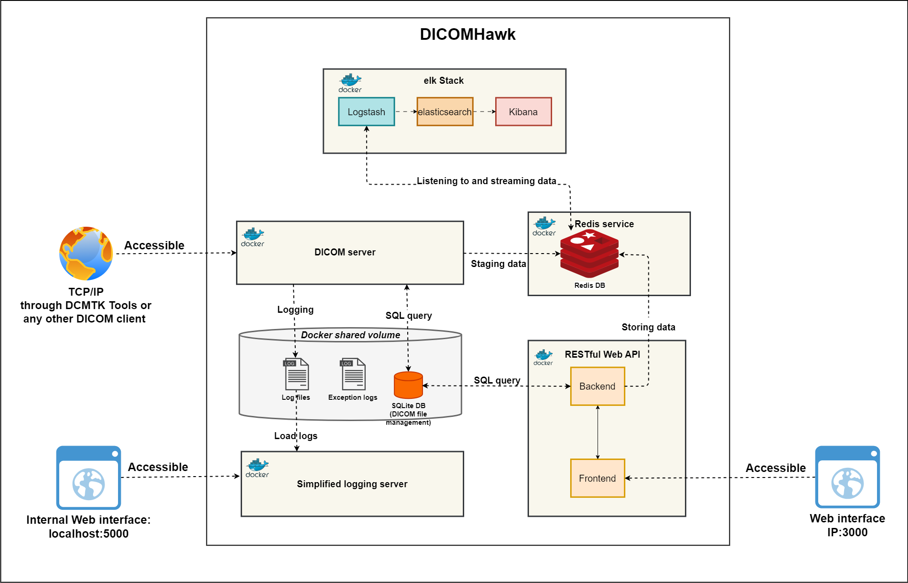
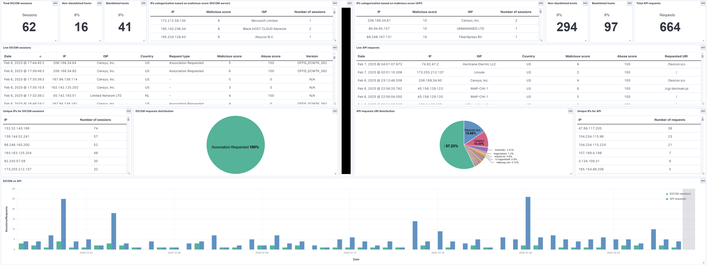

# DICOMHawk

[](cover_images/dicomhawk_logo.png)

> **A powerful and efficient honeypot for DICOM servers, designed to attract and log unauthorized access attempts and interactions in healthcare environments.**

DICOMHawk is a sophisticated cybersecurity tool built using Flask and pynetdicom that offers a streamlined web interface for monitoring and managing DICOM interactions in real-time. It serves as an advanced deception technology specifically designed for medical imaging environments, helping security teams detect, analyze, and respond to potential threats targeting DICOM infrastructure.

## 🚀 Key Features

### Core DICOM Functionality
- **Full DICOM Protocol Support**: Enables potential attackers to perform DICOM operations on both standard DICOM information models (STUDYROOT and PATIENTROOT) through its DICOM port
- **REST API Service**: Provides an API service enabling attackers to interact with the DICOM server content. Using the API endpoints, an attacker can search and download studies, series, patient and images data. Moreover, they can upload files to the Web API server.
- **Real Medical Data Integration**: Stores real DICOM files that are updated periodically through "The Cancer Imaging Archive (TCIA)" API, which metadata as PHI is modified to resemble real patient data of Danish 
citizens in the Danish settings.

### Advanced Security Features
- **Comprehensive Honeytoken System**: Multiple types of honeytokens including:
  - Encapsulated PDF canary tokens
  - HoneyURLs (fake URLs seeded into DICOM datasets)
  - Credential honeytokens
  - Hidden endpoints and credentials in source code
- **Threat Intelligence Integration**: Automatic reputation checks on each unique IP address interacting with the honeypot
- **Kernel-Level Protection**: Optional Blackhole service for blocking known mass-scanner services at the kernel level

### Data Localization
- **Multi-Locale Patient Data**: Offers multi-locale patient data generation with configurable regional setting that support different locales for realistic patient name generation.

### Monitoring & Management
- **Centralized Security Monitoring**: Elastic Stack integration with Logstash for comprehensive attacker activity tracking
- **Automated Log Management**: Daily rotation and compression with intelligent disk space management
- **Interactive Configuration**: Command-line setup wizard guiding users through essential configurations

## Table of Contents

- [Quick Start](#quick-start)
- [Deploying DICOMHawk Using Docker Compose](#deploying-dicomhawk-using-docker-compose)
- [Running DICOMHawk Locally](#running-dicomhawk-locally)
- [Configuration](#configuration)
- [Advanced Configuration](#advanced-configuration)
- [Usage Examples](#usage-examples)
- [DICOMHawk Monitoring System](#dicomhawk-monitoring-system)
- [Honeytokens](#honeytokens)
- [Log Management](#log-management)

## Quick Start

Get DICOMHawk running quickly with simple installation process.

### Prerequisites

Before installing DICOMHawk, ensure you have:

- **Docker** installed on your system (with Docker Hub access)
- **Docker Compose** for managing multiple containers
- **TCIA account** - free credentials from [The Cancer Imaging Archive](https://www.cancerimagingarchive.net/access-data/)
- **Port availability** - ensure required ports are available (see [Port Requirements](#port-requirements))

### Docker Daemon Check

Before proceeding with installation, verify that the Docker daemon is running:

**Linux/macOS:**
```bash
sudo systemctl status docker
# or
docker info
```

**Windows:**
```powershell
Get-Service docker
# or
docker info
```

**macOS (Docker Desktop):**
```bash
docker info
```

If Docker is not running, start it:

**Linux:**
```bash
sudo systemctl start docker
```

**Windows:**
```powershell
Start-Service docker
```

**macOS:**
Open Docker Desktop application or run:
```bash
open -a Docker
```

### Quick Installation

1. **Clone the Repository**
   ```bash
   git clone https://github.com/honeynet/DICOMHawk.git
   cd DICOMHawk
   ```

2. **Run the Automated Setup**
   ```bash
   ./install.sh
   ```

3. **Follow the Interactive Wizard**
   - The script guides you through configuration
   - Accept defaults for most settings
   - Focus on essential TCIA credentials(Username & Password)
   - For detailed configuration options, see the [Configuration](#configuration) section

### Access Your DICOMHawk Instance

Once deployed, access your honeypot through:

- **Web Dashboard**: http://localhost:5000
- **API Service**: http://localhost:3702
- **DICOM Server**: localhost:11112

## Deploying DICOMHawk Using Docker Compose

> **💡 Alternative Deployment Method**: This method can be used as an alternative to the Quick Start installation. However, you'll need to manually create your `.env` file with all required configuration settings before deployment.

### Docker Daemon Check

Before proceeding with deployment, ensure the Docker daemon is running:

**Linux/macOS:**
```bash
sudo systemctl status docker
# or
docker info
```

**Windows:**
```powershell
Get-Service docker
# or
docker info
```

**macOS (Docker Desktop):**
```bash
docker info
```

If Docker is not running, start it:

**Linux:**
```bash
sudo systemctl start docker
```

**Windows:**
```powershell
Start-Service docker
```

**macOS:**
Open Docker Desktop application or run:
```bash
open -a Docker
```

### Port Requirements

Before deployment, ensure these ports are available:

| Service           | Port       | Purpose                                |
|-------------------|------------|----------------------------------------|
| **Web Dashboard** | 5000       | Main web interface for monitoring      |
| **API Service**   | 3702       | REST API for programmatic access       |
| **DICOM Server**  | 11112      | Medical imaging protocol server        |
| **Redis**         | 6379       | Fast data storage (internal)           |
| **Elasticsearch** | 9200, 9300 | Search and analytics (monitoring mode) |
| **Kibana**        | 5601       | Data visualization (monitoring mode)   |

### Port Availability Check

**Linux:**
```bash
netstat -tuln | grep -E '11112|5601|3702|5000|6379'
```

**Windows:**
```powershell
Get-NetTCPConnection | Where-Object { $_.LocalPort -eq 11112 -or $_.LocalPort -eq 3702 -or $_.LocalPort -eq 5000 -or $_.LocalPort -eq 6379 } | Format-Table
```

### Deployment Architecture



### Service Profiles

DICOMHawk uses Docker Compose profiles for flexible deployment:

| Profile    | Services Included                    | Use Case                    |
|------------|-------------------------------------|----------------------------|
| **main**   | DICOM server, API, Redis, log server | Core honeypot functionality |
| **monitoring** | Elasticsearch, Kibana, Logstash | Advanced monitoring stack  |

### Available Interfaces

| Interface | URL | Purpose |
|-----------|-----|---------|
| **Kibana Dashboard** | http://localhost:5601/app/dashboards | Advanced monitoring and visualization |
| **Simplified Logging Server** | http://localhost:5000 | Basic log viewing and management |
| **Web API User Interface** | http://localhost:3000 | API interaction and testing |


### Default Credentials of API Interface
- **Username**: `test`
- **Password**: `test`

> **Note**: These are honey credentials designed to detect unauthorized access attempts.
### Deployment Commands

```bash
# Clone repository (may take time due to large DICOM files)
git clone https://github.com/honeynet/DICOMHawk.git
cd ./DICOMHawk

# Start core services only
docker compose --profile main up -d

# Start monitoring services only
docker compose --profile monitoring up -d

# Start all services
docker compose --profile main --profile monitoring up -d
```

## Running DICOMHawk Locally

> **💡 Development/Testing Deployment Method**: This method is ideal for development, testing, or when you need full control over individual services. It requires manual setup of each component and configuration management.

### Prerequisites

**Port availability** - ensure required ports are available (see [Port Requirements](#port-requirements))

#### Redis Service
**Ensure Redis is running on port 6379. You can start Redis using the following command if you have Redis installed:**

```bash
redis-server --port 6379
```

**If you do not have Redis installed, you can easily run a Redis instance using Docker with the following command:**
```bash
docker run -p 6379:6379 --name redis-db -d redis
```

#### Installing Packages
```bash
cd ./dicom_server
pip install -r requirements.txt
```

### Service Startup

#### DICOM Server
```bash
cd ./dicom_server
python main.py  # Use python3 main.py if your environment defaults to Python 3
```

#### Run the API using Node.js:
```bash
cd ./API
node app.js
```

#### Flask Logging Server
```bash
cd ./flask_logging_server
python logserver.py  # Use python3 logserver.py if your environment defaults to Python 3
```

### Monitoring Stack

To deploy the monitoring stack, navigate to the root directory and run the Docker Compose file which contains the monitoring stack's configurations.
```bash
cd monitoring_stack/
docker compose --profile main up -d
```

## Configuration

### Essential Configuration (Required)

#### [1] TCIA Credentials
**Required for downloading real medical images**

DICOMHawk integrates with The Cancer Imaging Archive (TCIA) to provide authentic medical imaging data:

- **TCIA Account Setup**: Create a free account at [TCIA](https://www.cancerimagingarchive.net/access-data/) following the [account creation guide](https://wiki.cancerimagingarchive.net/pages/viewpage.action?pageId=23691309)
- **Automatic Updates**: Files are retrieved from publicly available repositories with licenses saved in:
  ```
  dicom_server/dicom_storage/tcia_data/modality/[StudyInstanceUID]/SeriesInstanceUID/LICENSE
  ```

**Configuration Parameters:**
- `TCIA_USER_NAME`: Username for TCIA API authentication
- `TCIA_PASSWORD`: Password for TCIA API authentication
- `TCIA_ACTIVATED`: Boolean (`yes`/`no`) to activate/deactivate TCIA service
- `TCIA_PERIOD_UNIT`: Time unit (`day`, `week`, `hour`, `minutes`) for update frequency
- `TCIA_PERIOD`: Numerical frequency value (e.g., `2` weeks = updates twice weekly)
- `MODALITIES`: Array of modalities to retrieve (e.g., `["CT", "MR", "US", "DX"]`)
- `MINIMUM_TCIA_FILES_IN_SERIE`: Minimum files per series
- `MAXIMUM_TCIA_FILES_IN_SERIE`: Maximum files per series

### Optional Configuration

#### [2] Security Settings
**Auto-generated for production use**

JWT and session management secrets for secure authentication:

- **Access Token Secret**: JWT authentication signing
- **Refresh Token Secret**: Session refresh token signing
- **Admin Secret**: Admin authentication signing
- **Admin Refresh Token Secret**: Admin session refresh
- **Session Secret**: User session management

#### [3] API Settings
**Web API configuration**

- **API Port**: REST API service port (default: 3702)

> **⚠️ Important**: If changing the API port, update both `docker-compose.yml` and `API/Dockerfile` accordingly.

**Example**: If you change API port to 8080, update:

- [`docker-compose.yml`](docker-compose.yml#L42) → `api` service: `"3702:3702"` → `"8080:8080"`
- [`API/Dockerfile`](API/Dockerfile#L8): `EXPOSE 3702` → `EXPOSE 8080`

#### [4] Threat Intelligence APIs
**Enhanced security detection (optional)**

Integrate with external threat intelligence services:

- **[AbuseIPDB](https://www.abuseipdb.com/)**: IP reputation checking
- **[IPQualityScore](https://www.ipqualityscore.com/)**: Enhanced IP analysis
- **[VirusTotal](https://www.virustotal.com/gui/home/upload)**: Malware detection

#### [5] DICOM Settings
**Multi-port DICOM server configuration**

- **DICOM Ports**: Server listening ports (default: 11112)
- **DICOM_IMPLEMENTATION_NAME**: Server identification (default: ORTHANC)
- **DICOM_IMPLEMENTATION_UID**: Unique server identifier

> **⚠️ Important**: Port changes require updates to `docker-compose.yml` and `dicom_server/Dockerfile`.

**Example**: If you change DICOM port to 104, update:

- [`docker-compose.yml`](docker-compose.yml#L109) → `dicom_server` service: `"11112:11112"` → `"104:104"`
- [`dicom_server/Dockerfile`](dicom_server/Dockerfile#L37): `EXPOSE 11112` → `EXPOSE 104`

#### [6] Regional Settings
**Patient data localization**

- **Faker Locale**: Language for patient names (default: en_US)
- **OSM Enabled**: Location services (default: true)
- **OSM Country Code**: Country for location data (default: DK)
- **OSM City**: Specific city (optional)

#### [7] Honeypot Settings
**Decoy configuration for intrusion detection**

- **Honey URL**: Fake URL that triggers alerts when accessed

## Advanced Configuration

### DICOMHawk Configuration File

`config.py` contains the main configuration constants and is located in the project root. These settings can be overridden via environment variables in docker compose file.

### Key Configurable Parameters

#### General Configuration
- **PROD**: Environment mode (`yes`/`no`)
  - `yes`: Production mode with optimized settings
  - `no`: Development mode with debug details and system information

#### Logging Configuration
- **FLASK_ACTIVATED**: Flask server logging (`yes`/`no`)

#### Integrity Checks
- **INTEGRITY_CHECK**: Periodic DICOM file integrity verification (`yes`/`no`)

#### DICOM Server and Blackhole Configuration
- **DICOM_SERVER_HOST**: DICOM server IP address or hostname
- **BLOCK_SCANNERS**: Mass scanner blocking (`yes`/`no`)

## Usage Examples

### DICOM Protocol Interaction

Users can interact with the DICOM server using standard DCMTK tools:

#### Connection Verification
```bash
echoscu localhost 11112
```

#### Patient Queries
```bash
findscu -v -S -k QueryRetrieveLevel=PATIENT localhost 11112
```

#### Study Queries
```bash
findscu -v -S -k QueryRetrieveLevel=STUDY localhost 11112
```

#### File Storage
```bash
storescu -v -d localhost 11112 [Path to your DICOM file]
```

### DICOM Client Applications

DICOMHawk is compatible with various DICOM client applications:

- **Sante DICOM Viewer**: [Download here](https://santesoft.com/win/sante-dicom-viewer-lite/sante-dicom-viewer-lite.html)
- **Other DICOM viewers**: Any DICOM-compliant client application

## DICOMHawk Monitoring System

### Overview

DICOMHawk implements a centralized security monitoring infrastructure designed to track and analyze attacker behavior in healthcare environments. This system enables cybersecurity teams to:

- **Quick Detection**: Rapidly identify security incidents
- **Pattern Analysis**: Understand attacker techniques and interaction patterns
- **Forensic Capabilities**: Maintain detailed logs for comprehensive analysis
- **Impact Assessment**: Trace the source and impact of each interaction



### Monitoring Components

The monitoring system provides:

- **Real-time Metrics**: Summary statistics and detailed analysis
- **Multi-format Visualizations**: Numbers, tables, pie charts, and timelines
- **Threat Scoring**: Immediate malicious and abuse scoring for each interaction
- **Comprehensive Logging**: Detailed tracking of DICOM sessions and API requests

### Architecture

The monitoring system utilizes the Elastic Stack:

1. **Logstash**: Collects data from log files integrated with the honeypot
2. **Elasticsearch**: Indexes and stores security events for analysis
3. **Kibana**: Provides powerful data visualization and dashboard capabilities

## Honeytokens

Honeytokens (canary PDFs and honeyURLs) are security measures used to detect and alert on unauthorized access or potential breaches.

### DICOM Server Honeytokens

The DICOM server in DICOMHawk is designed to automatically update its DICOM file repository periodically, pulling new files from The Cancer Imaging Archive (TCIA). During this update process, the system injects selected DICOM files with honeytokens, specifically canary PDFs and honeyURLs, as part of its enhanced security measures.

When the DICOM server periodically removes old DICOM files and retrieves new ones from TCIA, the updated canary PDF and honeyURL are automatically injected into some of these new files. This ensures that the security features are consistently refreshed and tailored to current monitoring and security needs.

#### Canary PDFs
Canary PDF files serve as monitored tokens within DICOM files.

- **Location**: `dicom_server/storage/can.pdf` (maps to `/opt/dicomhawk/storage/can.pdf` in container)
-  The server uses this file as a template for generating canary PDFs injected into new DICOM files retrieved from TCIA. Make sure the updated PDF is named can.pdf to ensure it is properly recognized and utilized by the system.

#### HoneyURLs
HoneyURLs are URLs embedded within DICOM data. When accessed, they indicate potential unauthorized interactions.

```bash
HONEY_URL="https://[YOURHONEYURL]"
```
- Replace `[YOURHONEYURL]` with your desired honey URL

- This change in the environment variable ensures that any new DICOM files automatically fetched and updated by the server will include the new honeyURL.

### Web API Honeytokens

The Web API has also employed four honeytoken types to detect different attack vectors.

#### robots.txt and Hidden Endpoints
- Allows an attacker to be misguided and mislead to, for example, the endpoints called: "/admin", "/admin-config", "/secure" and "/ensurance_data".
- The purpose of this file is to make the attackers curious to explore the Web API and think of ways to get access to those protected resources. In this way, more meaningful information on attackers' actions can be collected. 
- If someone accesses the "robots.txt" file, the interaction is immediately logged and visualized within the visualization dashboard which helps identifying potential crawling or scraping activities.
- When for example, the "/admin" endpoint is accessed a fake admin access token is generated, which is not differing in size from the original access token. This is meant to provide inspiration for the potential adversaries.

#### Honey Credentials

- Fake credentials appear to be "leaked" in the login page of the Web API. They are to be found in the raw html source. If these credentials are used by a potential adversary, they are taken to an "Under development" screen. 
- Moreover, in order to access the Web API from the very start, the potential adversary has to login into the system.
- Honey credentials "test" - "test" are used. 
- The login page is continuously monitored for login attempts and therefore guessing, credential stuffing and brute force attacks can be identified.

## Log Management

DICOMHawk implements comprehensive automated log management through the `dicomhawkinit` service.

### Features

- **Daily Log Rotation**: Automatic log file rotation
- **Compression**: Efficient storage using pigz compression
- **Cleanup**: Automatic removal of logs older than 30 days (configurable)
- **Organization**: Structured log storage and management

DICOMHawk captures detailed information about:

All logs are stored under `/data/dicomhawk/logs/`:

| Directory/File | Content | Purpose |
|----------------|---------|---------|
| `dicom_raw_logs/` | Raw DICOM protocol messages, association requests/releases, C-FIND/C-GET/C-STORE operations, detailed packet-level communication | Deep protocol analysis and debugging |
| `simplified/` | Clean DICOM transaction summaries, patient queries, study retrievals, association events with timestamps and IP addresses | Quick event review and monitoring |
| `exceptions/` | Python exceptions, service errors, configuration issues, startup failures, runtime problems | Troubleshooting and system health monitoring |
| `api_logs.log` | REST API requests/responses, authentication attempts, file uploads/downloads, user sessions, endpoint access | API usage monitoring and security analysis |
| `reputation.log` | IP reputation scores, threat intelligence results, abuse scores, geographic data, proxy/VPN detection | Security analysis and threat assessment |
| `scanned_ips.log` | IP scanning patterns, port scans, connection attempts, attack signatures, frequency analysis | Attack detection and pattern recognition |

### Configuration

Customize log retention through environment variables:

```yaml
dicomhawkinit:
  environment:
    - PERSISTENCE_CYCLES=30  # Days to retain logs
```
